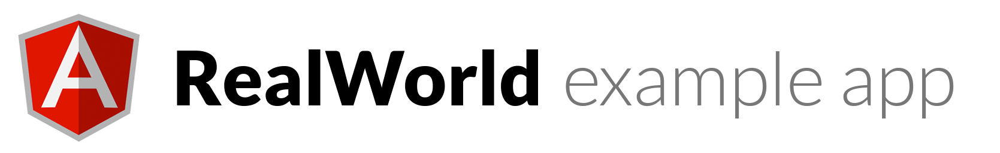

# 

> Example Angular 1.5+ (ES6 + Components) codebase that adheres to the [RealWorld](https://github.com/gothinkster/realworld-example-apps) spec and API.

View the **[demo application](https://angularjs.realworld.io)** or **[learn how to build the application from scratch](https://thinkster.io/angularjs-es6-tutorial)**!

# Getting started

1. Clone repo
2. `npm install`
3. `gulp`

Make sure you have gulp installed globally (`npm install -g gulp`)
